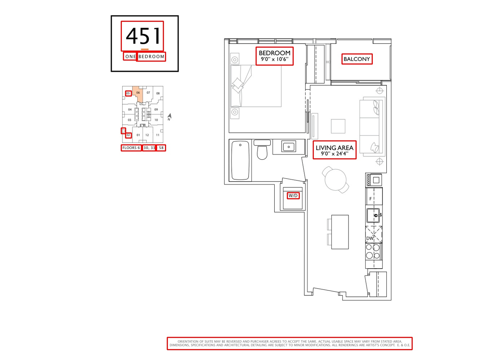
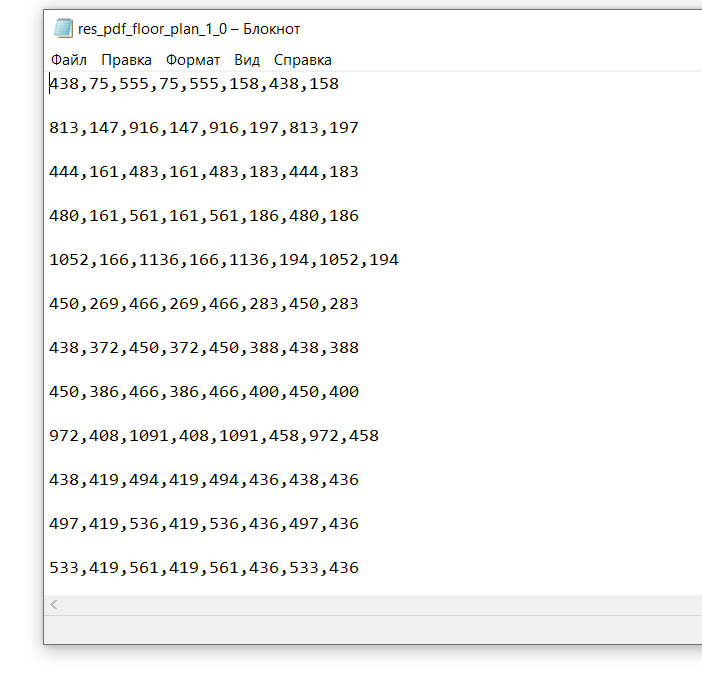
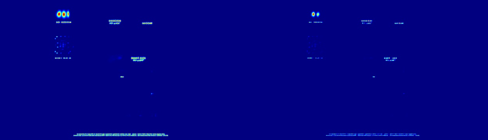

# Seneca Floorplan Project

this repo is for RM floor project.

In this project we have 4 main modules:

1. Direction Classification - used to classify directions signs in the image.
2. Floorplan Classification - used to train CNN model to classify floorplan images from surveys and other images
3. Unit Number OCR - used to extract unit numbers from key plate and to extract direction for each unit number
4. Room Floor Area OCR - used to extract area (total and inner), floor numbers and number of rooms for floorplan image.


Also, we have 3 auxiliary modules

1. CRAFT - used in Unit Number OCR and Room Floor Area OCR, mainly to identify text regions in the image. 
2. CNN model - used to train CNN architecture (in particular used to train models to recognize key plates and directions signs in the image)
3. Unit Testing - used to store results from different program runs. Also, has unit_test.py used to test derived results with the xlsx database

Finally, sample folder contains the input images for Direction Classification, Unit Number OCR and Room Floor Area OCR modules.


## Main modules details

### Direction Classification

1. Figure our virtual env for the module: 
```
python -m venv venv
```

Please, use python 3.11 for this module.

2. All required dependencies are listed in requirements.txt

```
pip install -r requirements.txt
```

3. Main.py calls a trained model, directions_classifier.keras, to classify key plate objects on the image. You can use CNN model module to train your own model, if needed. 
Note, that current model is not accurate enough due to limited amount of labeled data. Retraining is highly recommended.
4. Run main.py to classify direction sigh for the given image. Also, the function will write the coords of the identified direction region to the txt file located in folder named direction_coords within base dir.

### Floorplan Classification

1. Figure our virtual env for the module: 
```
python -m venv venv
```

Please, use python 3.11 for this module.

2. All required dependencies are listed in requirements.txt

```
pip install -r requirements.txt
```

3. Next, make sure to figure out 2 environmental variables for training and, if you have, prediction data.
As a default main.py uses image_training_data and image_prediction_data names. Note that structure for image_training_data folders should be as follows:

```
image_training_data
    floorplan (this folder consists of pdfs files representing floorplans)
    other (this folder contains other class images)
    surveys (this folder contains surveys class images)
```

4. Finally, you can run main.py. It accepts 2 flags: train_save and predict. If you run with train_save it will train and save the model in specified loc.
If you run with predict it will make predictions on new data. Note, that predictions are not saved anywhere. 

### Unit Number OCR

1. Figure our virtual env for the module: 
```
python -m venv venv
```

Please, use python 3.11 for this module.


2. All required dependencies are listed in requirements.txt

```
pip install -r requirements.txt
```

3. Note that input images to main.py are coming from 'sample' folder. 
4. Main.py calls CRAFT. The parameters to 'run_craft' function should not be changed. 
More info about CRAFT params in the CRAFT module sections (in particular you have to install their craft_mlt_25k.pth model).
5. Main.py calls a trained model, keyplates_classifier.keras, to classify key plate objects on the image. You can use CNN model module to train your own model, if needed. 
6. You can run main.py to save unit numbers and their directions for each image in unit_testing/unit_number_direction.xlsx file.

### Room Floor Area OCR

1. Figure our virtual env for the module: 
```
python -m venv venv
```

Please, use python 3.11 for this module.


2. All required dependencies are listed in requirements.txt

```
pip install -r requirements.txt
```

3. Note that input images to main.py are coming from 'sample' folder. 
4. Main.py calls CRAFT. The parameters to 'run_craft' function should not be changed. More info about CRAFT params in the CRAFT module sections.
5. You can run main.py to save OCR information for each image in unit_testing/craft_ocr_output.xlsx file. 

## Auxiliary modules details

### CRAFT

This is a CRAFT package cloned from here:

```
git clone https://github.com/clovaai/CRAFT-pytorch.git
```

Please, use python 3.9 or lower for this module. (3.9 recommended)

It's run via test.py (examples bellow).

To run default CRAFT we can use:

```
python test.py --trained_model=craft_mlt_25k.pth --test_folder=test/
```

This package helps us to identify text regions in the image so that we could pass them to OCR engine.
In this project we slightly modified CRAFT. As a default it produces 3 files for each image:

1. Changed version of the passed image which includes identified regions



2. txt file which stores the coords of each box



3. Heat map for each box (not used by us)



Our modified version of CRAFT, in addition to above described features, can do the following:

1. Accept new argument, called area_floor_rooms and area_floor_rooms_save_path. This enables merging/concatenating the original boxes produced by CRAFT.
Note, that CRAFT with this params is called in Room Floor Area OCR module.
2. Accept new argument called key_plates and 2 saving ags called unit_number_save_loc and unit_testing_save_path. This enables extracting a unit number from given key plate object.
Note, that CRAFT with this params is called in unit number ocr module. unit_number_save_loc is the location to save unit number in txt file for further direction analysis.
unit_testing_save_path on the other hand is the ultimate location where to save unit numbers.

For example, to enable CRAFT merging/concatenating the original boxes:

```
python test.py --trained_model=craft_mlt_25k.pth --area_floor_rooms=True --area_floor_rooms_save_path=unit_testing/craft_ocr_output.xlsx
```

Again, you do not need to call CRAFT manually, it is done for you in the main modules. To read more about CRAFT, including set up info, visit:

```
https://github.com/clovaai/CRAFT-pytorch
```


### CNN model

This module is not called/used anywhere. It is only to train CNN model to classify target object on the image.

1. Figure our virtual env for the module: 
```
python -m venv venv
```

Please, use python 3.11 for this module.


2. All required dependencies are listed in requirements.txt

```
pip install -r requirements.txt
```

1.	You have to create a labeled dataset (see directions data or key plates data as an example). 
2.	Open CNN model module (use python 3.11 to create venv).
3.	Then, change values of 2 variables.  Set TARGET_NAME to the ‘directions’ or ‘key_plates.  Set SOURCE to the path to your labeled dataset.
4.	Run main.py. It will create model.keras called MODEL_NAME in the CNN model directory (you can of course change that). 

### Unit Testing

This module stores all the results from different module runs. It also has unit_test.py which used GPT to analyze raw OCR output.

To run unit_test.py you need:

1. Establish you OpenAI key and store it in environmental var called 'OPENAI_API_KEY'. 
More info can be found here:

```
https://platform.openai.com/docs/quickstart?context=python
```

2. Create venv and download packages from requirements.txt

```
python -m venv venv
pip install -r requirements.txt
```

3. Finally, run the program. It will output those records on which GPT made a mistake in their corresponding Excel file with prefix 'error_'.
After you reviewed errors you can adjust the prompts.


### Possible Improvements:

1. Direction analysis.
2. Prompt improvement for GPT